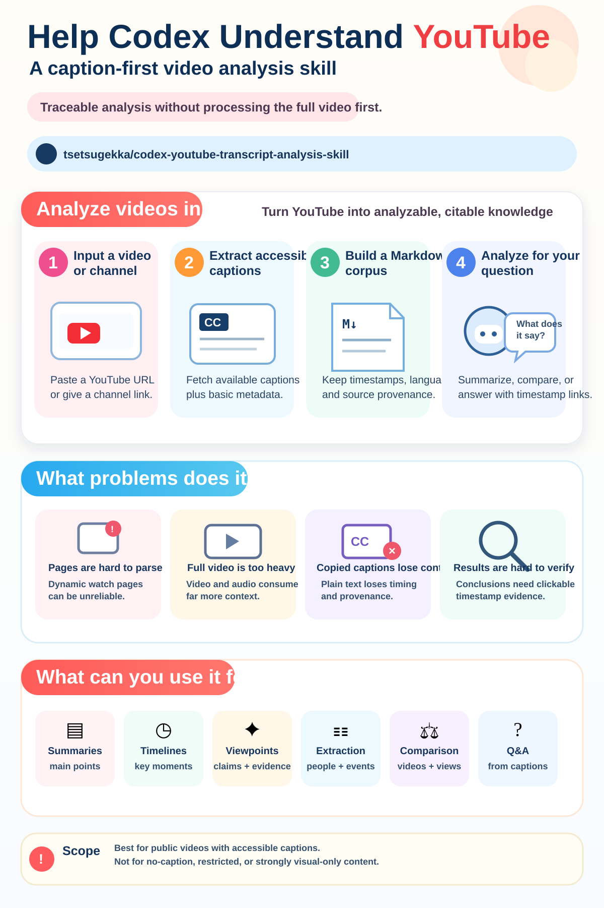

# YouTube Transcript Analysis Skill for Codex

[](skills/analyze-youtube-video/SKILL.md)
[](skills/analyze-youtube-video/scripts/extract_transcript.py)
[](#security-rules)

Languages: **English** | [简体中文](README.zh-CN.md)

A reusable Codex skill that turns accessible YouTube captions into a compact, traceable analysis corpus—without requiring Codex to process the full video or depend entirely on the watch page.

<p align="center">
  
</p>

## The Problem It Solves

YouTube analysis from an agent has four recurring problems:

| Problem | What this skill changes |
| --- | --- |
| A YouTube watch page can be difficult for Codex to open or parse because it is dynamic, throttled, or guarded against automated requests. | The workflow does not make direct watch-page understanding a hard dependency. It extracts an available caption track separately and uses oEmbed or search only as metadata fallbacks. |
| Sending full video, audio, or many sampled frames consumes much more model context than most spoken-content questions require. | The main analysis input is compact caption text, so context usage follows the spoken transcript instead of video resolution, frame count, and audio data. |
| Plain copied captions lose track type, precise timing, and source provenance. | The extractor creates one self-contained Markdown document whose YAML frontmatter and transcript bullets retain raw floating-point timing, language, and manual/automatic track metadata. |
| Finding a channel's latest or recent uploads through repeated search requests is slow and can increase request volume. | After the official channel ID is known, one YouTube RSS request returns a reusable recent-upload list with publication timestamps. |
| A summary without source navigation is difficult to audit. | Important conclusions can link directly to the supporting moment in the original video. |

This is especially useful when the user wants to know *what was said*: a summary, viewpoint map, outline, timeline, structured extraction, comparison, or a grounded answer from the transcript.

## Why Captions First

Only the spoken text and small metadata records need to enter the model's working context. The workflow does not upload video pixels, decode the complete audio track, or sample frames by default. For long videos, this can reduce token and processing cost substantially while still preserving the complete spoken sequence.

The transcript is a corpus, not a fixed analysis template. Codex can summarize it, organize claims and evidence, retrieve relevant passages for RAG-style questions, or combine it with separately labeled external verification. The user's prompt determines the analysis.

## When Direct YouTube Access Is Restricted

The skill can sometimes continue when Codex cannot reliably consume the YouTube watch page, because caption retrieval is a separate step. If the caption track remains accessible, Codex can analyze the transcript even when watch-page metadata parsing fails; title and channel metadata then fall back from the video page to YouTube oEmbed and finally to search results.

This is a resilient alternate path, not a promise to bypass YouTube controls. It does not defeat authentication, members-only access, age or region restrictions, disabled captions, or request throttling. If the caption endpoint is also unavailable, the subtitle workflow stops and reports the limitation.

## Capability Boundary

| Supported by the default workflow | Outside the default workflow |
| --- | --- |
| Public videos with an accessible human-authored or automatic caption track | Videos with no accessible captions, disabled captions, or caption requests blocked by YouTube |
| Questions about spoken content: summaries, viewpoints, claims, numbers, timelines, comparisons, extraction, and transcript-grounded Q&A | Questions that depend on charts, demonstrations, gestures, speaker identity from images, on-screen text missing from captions, music, sound effects, tone, or editing |
| Timestamp links that navigate to the supporting spoken passage | Independent verification that the speaker's claims are true |
| Best-effort title, channel, and date metadata with explicit source and uncertainty fields | Guessing an upload date from a title, channel schedule, search context, or current date |
| Reporting automatic-caption uncertainty and unclear wording | Silently correcting uncertain transcript text or inventing content from titles, thumbnails, comments, or search snippets |

The skill never downloads or transcribes audio automatically when captions fail. It instead offers a copy-ready Gemini `@youtube` prompt in the language of the user's current request, preserving the original task, focus, requested detail, and output format while adding the canonical video URL and precise `?t=xxx` source-link requirement. This is a handoff option, not a claim that Codex ran Gemini or bypassed YouTube controls. Audio transcription or multimodal video analysis by Codex remains a separate, potentially more expensive workflow and requires explicit user approval.

## What This Is

This repository packages one Codex skill, a channel RSS helper, and a caption extractor. It identifies recent candidate videos efficiently, converts an available transcript into one metadata-rich Markdown document, and lets Codex complete the user's requested analysis with selective source links.

## Skill

| Skill | Purpose |
| --- | --- |
| [`analyze-youtube-video`](skills/analyze-youtube-video/SKILL.md) | Resolve a video URL, bootstrap an isolated Python environment, extract captions and metadata, then perform prompt-driven analysis with timestamp links. |

## Example Prompts

```text
Use $analyze-youtube-video to summarize this video and link each major conclusion to the supporting timestamp: YOUTUBE_URL
```

```text
Use $analyze-youtube-video to find the latest completed public upload from CHANNEL_NAME and organize the speaker's claims, evidence, forecasts, and caveats.
```

```text
Use $analyze-youtube-video to treat this video's transcript as a RAG corpus and answer: What reasons does the speaker give for the expected change in demand?
```

If captions are unavailable, the skill can produce a same-language Gemini handoff prompt such as:

```text
@youtube
Please use your built-in YouTube extension to directly read and analyze this video: YOUTUBE_URL

Please complete this original task:
USER_REQUEST

Choose the structure, focus, level of detail, and output format that best fit the task instead of forcing a fixed template.
Align strictly with the timeline: after each key conclusion, answer, or extracted result, add a precise timestamp link containing ?t=xxx that opens the corresponding position in the original video.
```

The skill replaces `USER_REQUEST` with the user's actual task. Core themes, viewpoints, itemized facts, and recommendations are possible outputs, not mandatory fields.

## Features

- Processes the complete video by default, even when the supplied URL contains `t=`, `start=`, or a timestamp fragment.
- Uses one official channel RSS request to discover recent uploads and publication timestamps after resolving the official channel ID; the saved feed is reused for the task.
- Saves one self-contained Markdown transcript. YAML frontmatter preserves video and caption-track metadata; every subtitle bullet keeps raw floating-point `start` and `duration`, a millisecond timestamp, and a clickable YouTube link.
- When `--output` is an existing directory, automatically names the document `YYYY-MM-DD<video-id>.md` from a verified upload/publication date; title-only or unknown dates safely fall back to `undated-<video-id>.md`.
- Selects captions in this order: the user's requested or prompt language, the language conservatively inferred from the original video title, English, then any accessible track. A different-language caption is still extracted instead of being treated as no captions.
- Passes a dedicated `requests.Session` with a normal desktop-browser `User-Agent` to `youtube-transcript-api`; HTTP `Accept-Language` is not used as the caption-selection mechanism.
- Waits a random 2–6 seconds before each subtitle request to reduce burst traffic; it does not bypass YouTube blocking, and rate-limit errors stop further retries.
- Does not create companion transcript JSON or TXT artifacts. The channel helper's temporary feed JSON is only candidate-selection evidence for the active task.
- Resolves metadata in a fixed order: YouTube video page, YouTube oEmbed, then current search results when Codex still needs missing fields.
- Never infers upload dates. It labels a date found only in the title as `title date`, and otherwise reports `date unknown`.
- Adds selective links such as `https://www.youtube.com/watch?v=VIDEO_ID&t=51s` so readers can jump to supporting speech.
- Keeps analysis prompt-driven instead of forcing a generic summary or viewpoint template.
- When captions remain unavailable, returns a copy-ready Gemini `@youtube` prompt that preserves the user's original task instead of inventing an analysis or imposing a fixed summary template.

The channel RSS helper is for recent-video discovery only. This general-purpose Skill does not maintain annual transcript indexes, year catalogs, archive RSS feeds, or long-term retention; those are responsibilities of a separate archive system.

## Recommended Layout

```text
skills/
  analyze-youtube-video/
    SKILL.md
    requirements.txt
    agents/openai.yaml
    scripts/extract_transcript.py
    scripts/list_channel_feed.py
    tests/test_extract_transcript.py
    tests/test_list_channel_feed.py
```

## Installation and Usage

Copy the skill folder into your Codex skills directory:

```bash
git clone https://github.com/tsetsugekka/codex-youtube-transcript-analysis-skill.git
mkdir -p ~/.codex/skills
cp -R codex-youtube-transcript-analysis-skill/skills/analyze-youtube-video ~/.codex/skills/
```

Restart or refresh Codex skill discovery, then invoke `$analyze-youtube-video` in your prompt.

The skill requires Python 3.9 or newer and installs Python packages only into its own `.venv`. If Python itself is missing, the instructions require Codex to explain the proposed installation and obtain user permission before installing Python or system-level components.

To run the bundled regression tests from the skill directory:

```bash
python3 -m venv .venv
.venv/bin/python -m pip install -r requirements.txt
env PYTHONPYCACHEPREFIX=/tmp/youtube-skill-pycache \
  .venv/bin/python -m unittest discover -s tests -p 'test_*.py' -v
```

## Security Rules

- Do not place API keys, cookies, browser profiles, account data, or private logs in the skill package.
- Use the isolated skill virtual environment; do not install dependencies globally or with `sudo pip`.
- Treat private, members-only, age-restricted, region-blocked, or authentication-gated captions as inaccessible unless the user explicitly authorizes a separate authenticated workflow.
- Metadata lookup failures must not be hidden, and repeated requests must stop when YouTube appears rate-limited.
- A custom `User-Agent` and the random 2–6 second delay improve request compatibility and pacing; neither bypasses `RequestBlocked`, `IPBlocked`, HTTP 429, authentication, or regional controls.

## Disclaimer

This workflow analyzes available captions, not the complete audiovisual work. Lower token usage is a design advantage, not a guarantee of a fixed reduction: transcript length, requested depth, and external verification still affect context usage.

Automatic captions may contain recognition errors. Timestamp links provide navigation to the source speech, not independent verification of the speaker's claims.
