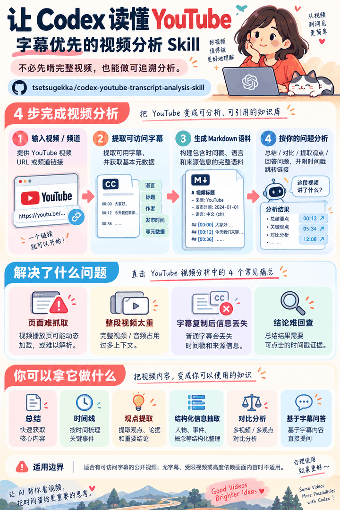

# Codex YouTube 字幕分析 Skill

[](skills/analyze-youtube-video/SKILL.md)
[](skills/analyze-youtube-video/scripts/extract_transcript.py)
[](#安全规则)

语言：[English](README.md) | **简体中文**

一个可复用的 Codex Skill：把可访问的 YouTube 字幕转换成紧凑、可追溯的分析语料，不要求 Codex 处理完整视频，也不把直接读取播放页作为唯一前提。

<p align="center">
  
</p>

## 它解决什么问题

Agent 分析 YouTube 视频时经常遇到四类问题：

| 问题 | 本 Skill 的处理方式 |
| --- | --- |
| YouTube 播放页是动态页面，还可能出现自动请求限制、限流或解析失败，Codex 不一定能稳定读取。 | 不把“Codex 必须直接理解播放页”作为硬依赖，而是单独获取可访问的字幕轨道；视频页失败时，元数据再依次回退到 YouTube oEmbed 和搜索结果。 |
| 直接输入完整视频、音频或大量采样帧，通常会占用远高于口述内容分析所需的模型上下文。 | 主要分析输入是紧凑的字幕文本，token 消耗主要随口述文本长度变化，而不是随视频分辨率、帧数和音频数据量变化。 |
| 普通复制的字幕会丢失字幕类型、精确时间和来源信息。 | 提取器生成一份自包含 Markdown；YAML frontmatter 与字幕条目共同保留原始浮点时间、持续时间、语言以及人工/自动字幕轨道类型。 |
| 通过反复搜索查找频道最新或近期视频速度较慢，也会增加请求量。 | 确认官方频道 ID 后，只请求一次 YouTube RSS，即可得到可复用的近期视频列表和发布时间。 |
| 只有摘要而没有原文位置，用户很难复核。 | 在重要结论后添加可点击时间链接，直接定位到视频中的对应原话。 |

它特别适合回答“视频里说了什么”：摘要、观点整理、提纲、时间线、结构化信息提取、视频比较，或者把字幕作为 RAG 语料回答具体问题。

## 为什么只分析字幕

进入模型主要工作上下文的是口述文本和少量元数据。默认流程不上传视频画面、不解码完整音轨，也不抽取大量视频帧。对于长视频，这通常可以显著降低 token 和处理成本，同时保留完整的口述顺序。

字幕是语料，不是固定分析模板。Codex 可以根据用户提示词进行摘要、整理观点与依据、检索相关段落回答问题，或者另外调用外部来源做事实核查；分析形式由用户问题决定。

## 播放页受限时为什么仍可能工作

字幕获取与 Codex 直接读取 YouTube 播放页不是同一个步骤。因此，当播放页无法稳定解析、但字幕轨道仍可访问时，Skill 仍可能取得字幕并继续分析。

这里所说的“绕开”，是绕开“必须让 Codex 直接读取和理解播放页”这一依赖，不是绕过 YouTube 的访问控制。它不能突破登录、会员、年龄、地区限制、关闭字幕或请求限流；如果字幕接口同样不可访问，字幕工作流就会停止并明确报告原因。

## 能力边界

| 默认支持 | 默认不支持 |
| --- | --- |
| 存在可访问人工字幕或自动字幕的公开视频 | 无字幕、字幕被关闭，或者字幕请求被 YouTube 阻止的视频 |
| 与口述内容有关的问题：摘要、观点、论据、数字、时间线、比较、信息提取和基于字幕的问答 | 依赖图表、演示动作、人物画面身份、字幕未记录的屏幕文字、音乐、音效、语气或剪辑的问题 |
| 用时间链接定位支撑结论的原话 | 自动证明讲者的主张真实可靠 |
| 尽力获取标题、频道和日期，并明确记录来源与不确定性 | 根据标题、频道更新规律、搜索上下文或当前日期猜测上传日期 |
| 根据字幕轨道信息提示自动字幕和不清晰措辞的风险 | 静默修正不确定字幕，或者根据标题、缩略图、评论和搜索摘要猜测视频内容 |

字幕失败时，Skill 不会自动下载视频或转录音频，而是根据用户当前提问语言生成一段可直接复制到 Gemini 的 `@youtube` 提示词。提示词会继承用户原始任务、关注重点、详细程度和输出格式，同时加入规范化视频 URL，并要求用精准的 `?t=xxx` 链接标注原文时间。这只是交给用户自行粘贴的备选方案，不代表 Codex 已经运行 Gemini 或绕过 YouTube 限制。由 Codex 执行音频转录或多模态视频分析仍是另外的、可能成本更高的工作流，需要用户明确同意。

## 这是什么

本仓库包含一个 Codex Skill、频道 RSS 辅助脚本和字幕提取器。它先高效确定近期候选视频，再把可用字幕转换成一份元数据完整的 Markdown，最后由 Codex 根据用户提示词分析，并按需添加原话链接。

## Skill

| Skill | 用途 |
| --- | --- |
| [`analyze-youtube-video`](skills/analyze-youtube-video/SKILL.md) | 确认视频 URL、配置隔离的 Python 环境、提取字幕与元数据，再按用户提示词分析并添加时间链接。 |

## 示例提示词

```text
使用 $analyze-youtube-video 总结这个视频，并在每项主要结论后连接到对应原话时间：YOUTUBE_URL
```

```text
使用 $analyze-youtube-video 找到 CHANNEL_NAME 最新一期已经完成的公开视频，整理讲者的观点、依据、预测和保留条件。
```

```text
使用 $analyze-youtube-video 把这个视频的字幕作为 RAG 语料回答：讲者认为需求将发生变化的原因是什么？
```

如果视频没有可访问字幕，Skill 会生成以下形式的 Gemini 交接提示词：

```text
@youtube
请使用你内置的 YouTube 扩展程序，直接读取并分析这个视频：YOUTUBE_URL

请按照我最初的要求完成以下任务：
USER_REQUEST

请根据上述要求自行选择最合适的分析结构、重点、详细程度和输出格式，不要机械套用固定模板。
请严格对齐时间轴：在关键结论、回答或提取结果后标注对应的精准时间，以带有 ?t=xxx 的链接，链接到原视频的对应位置。
```

Skill 会把 `USER_REQUEST` 替换成用户真正提出的任务。“核心主题与观点”“具体信息和建议”等只是可能的输出示例，并非固定必填项。

## 功能特点

- 即使 URL 含有 `t=`、`start=` 或时间片段，默认仍处理完整视频。
- 确认官方频道 ID 后，用一次 YouTube RSS 请求取得近期视频和发布时间，并在当前任务中复用保存的列表。
- 默认只保存一份自包含 Markdown 字幕。YAML frontmatter 保留视频和字幕轨道元数据；每条字幕保留原始浮点 `start`、`duration`、毫秒时间和可点击 YouTube 链接。
- `--output` 指向已存在目录时，根据已验证的上传/发布日期自动命名为 `YYYY-MM-DD<video-id>.md`；只有标题日期或日期未知时安全回退为 `undated-<video-id>.md`。
- 字幕选择顺序为：用户明确指定或当前提问语言、从视频原始标题保守识别出的语言、英语、任意可访问轨道。没有前几种语言时仍会提取其他语言字幕，不会误判成“无字幕”。
- 字幕 API 使用带常规桌面浏览器 `User-Agent` 的独立 `requests.Session`；HTTP `Accept-Language` 不用于决定字幕轨道。
- 每次字幕请求前随机等待 2–6 秒，以降低批量请求形成突发流量的概率；这不是绕过 YouTube 封锁的手段，遇到限流错误应停止继续请求。
- 不生成配套字幕 JSON 或 TXT。频道辅助脚本的临时 feed JSON 只作为当前任务选择候选视频的证据。
- 元数据固定按视频页、YouTube oEmbed、当前搜索结果的顺序回退。
- 不推断上传日期。只能从标题得到日期时标注“标题日期”，仍无法确认时标注“日期未知”。
- 按需添加 `https://www.youtube.com/watch?v=VIDEO_ID&t=51s` 形式的原话定位链接。
- 分析方式取决于用户提示词，不强制套用通用总结或观点模板。
- 字幕仍不可用时，按用户提问语言返回继承原始任务的 Gemini `@youtube` 提示词，而不是根据标题猜测分析结果或强制套用固定摘要模板。

频道 RSS 辅助脚本只负责发现近期候选视频。这个通用 Skill 不维护字幕年度索引、年份目录、归档 RSS 或长期保存期限；这些属于独立归档系统的职责。

## 推荐目录

```text
skills/
  analyze-youtube-video/
    SKILL.md
    requirements.txt
    agents/openai.yaml
    scripts/extract_transcript.py
    scripts/list_channel_feed.py
    tests/test_extract_transcript.py
    tests/test_list_channel_feed.py
```

## 安装与使用

把 Skill 文件夹复制到 Codex Skills 目录：

```bash
git clone https://github.com/tsetsugekka/codex-youtube-transcript-analysis-skill.git
mkdir -p ~/.codex/skills
cp -R codex-youtube-transcript-analysis-skill/skills/analyze-youtube-video ~/.codex/skills/
```

重新启动或刷新 Codex 的 Skill 发现，然后在提示词中调用 `$analyze-youtube-video`。

本 Skill 需要 Python 3.9 或更高版本，Python 包只安装到 Skill 自己的 `.venv`。如果系统缺少 Python，Skill 要求 Codex 先说明拟采用的安装方式并取得用户许可，才能安装 Python 或系统级组件。

在 Skill 目录运行回归测试：

```bash
python3 -m venv .venv
.venv/bin/python -m pip install -r requirements.txt
env PYTHONPYCACHEPREFIX=/tmp/youtube-skill-pycache \
  .venv/bin/python -m unittest discover -s tests -p 'test_*.py' -v
```

## 安全规则

- 不要把 API 密钥、Cookie、浏览器配置、账户数据或私有日志放进 Skill。
- 使用 Skill 自己的虚拟环境；不要全局安装依赖，也不要运行 `sudo pip`。
- 私密、会员、年龄限制、地区限制或需要登录的字幕默认视为不可访问，除非用户明确授权另外的认证流程。
- 不隐藏元数据抓取失败；YouTube 疑似限流时停止增加请求频率。
- 自定义 `User-Agent` 和 2–6 秒随机等待只改善请求兼容性与节奏，不能绕过 `RequestBlocked`、`IPBlocked`、HTTP 429、登录或地区控制。

## 免责声明

这个工作流分析的是可用字幕，而不是完整视听内容。降低 token 消耗是设计优势，不代表固定比例的节省；字幕长度、用户要求的分析深度以及是否需要外部核查仍会影响上下文用量。

自动字幕可能存在识别错误。时间链接用于定位讲者原话，并不等于对讲者主张进行了独立事实核查。
